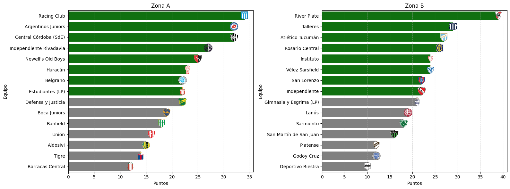
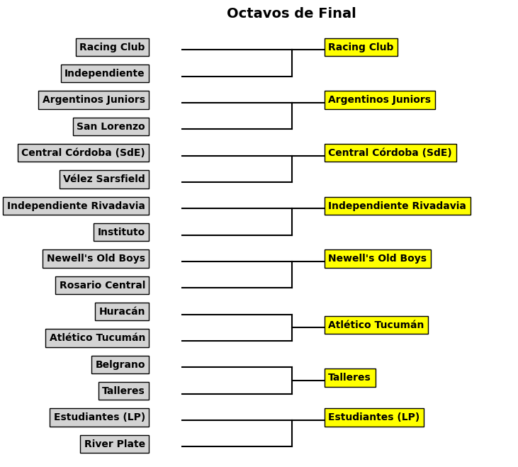
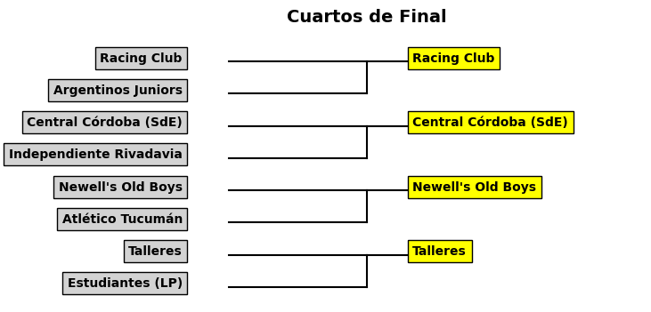
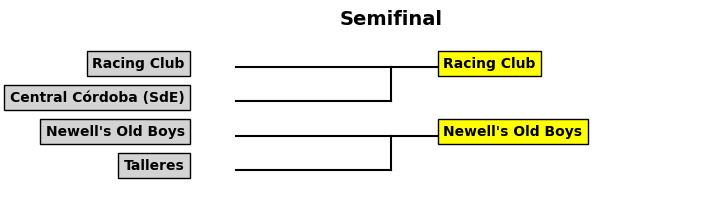
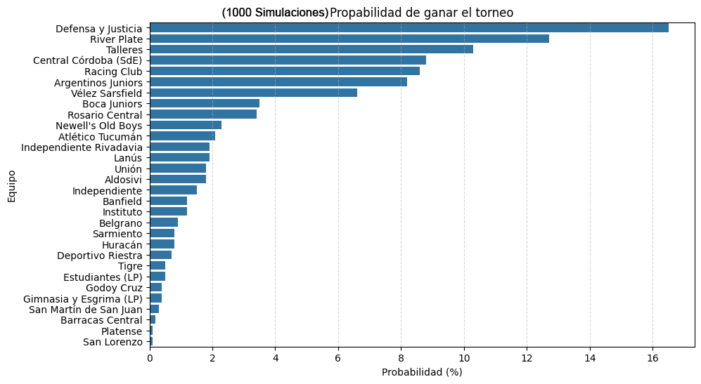

# 📊 Predicción de Resultados en la Liga Argentina

Este proyecto utiliza **ciencia de datos** y **aprendizaje automático** para predecir los resultados de los partidos de la Liga Argentina. 🏆⚽

## 📌 Características:
- Modelos de predicción de resultados usando estadísticas históricas y actuales📈
- Visualización de los resultados con gráficos📊
- Generación automática de cuadros de eliminatorias 🎯

## 🛠 Tecnologías utilizadas
- Python 🐍
- Pandas 📊
- Matplotlib 📉
- Scikit-learn 🤖

## 📷 Ejemplo de visualización

